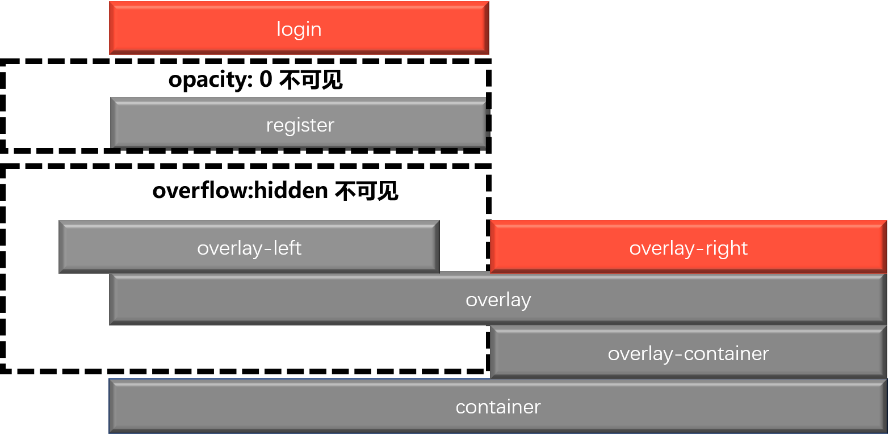
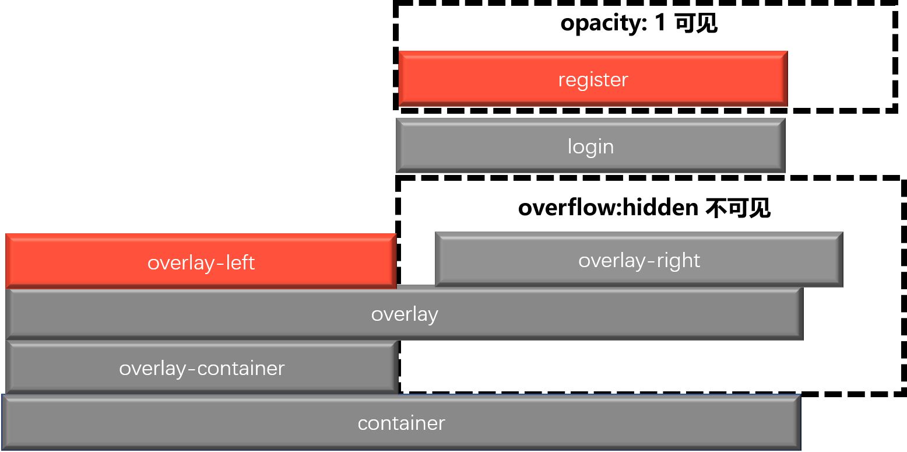

# 滑动登录注册页面

## 1. 核心逻辑

### 1.1 概览

页面整体可分为**左**和**右**两部分：

从最终效果看，只有两种情况：

	1. 左边展示 `login` 页面，右边展示 `overlay-right(去注册页面,下面以OR代替)` 页面
 	2. 左边展示`overlay-left(去登录页面，下面以OL代替) `页面，右边展示 `register` 页面

从实际布局看：

1. `login`和`register` 始终在同一边，根据`z-index` 决定显示哪个页面
2. `overlay-container(下面以OC代替)`只占据半屏，但是其子元素`overlay`占据满屏
3. `OL`始终在左半屏，`OR` 始终在右半屏，`OC` 左右移动，溢出 `OC` 的部分会由于`overflow:hidden`而隐藏
4. 被隐藏的`OL`向左偏移，被隐藏的 `OR` 向右偏移，以便切换时出现动画效果

### 1.2 登录

登录界面如下所示：

1. 左侧`login` 的 `z-index` 大于 `register`，且`OL`溢出被隐藏， 所以显示 `login`
2. 右侧显示`OR
3. 被隐藏的 `OL` 向左侧偏移



### 1.3 注册

注册页面如下所示：

1. 右侧`register` 的 `z-index` 大于 `login`，且`OR`溢出被隐藏， 所以显示`register`
2. 左侧显示 `OL`
3. 被隐藏的 `OR` 向右侧偏移



### 1.4 切换

当 `OR` 上的按钮被单击时，给 `container` 添加 `right-panel-active` 类名，当`OL`上的按钮被单击时，移除该类名。当存在该类名时：

- `register` 和 `login` 移动到右侧
- 增大 `register`的 `z-index `以提升层级
- `overlay-container` 移动到左侧
- 取消`overlay`向左的偏移 
- 取消`OL`向左的偏移
- `OR` 向右侧偏移

## 2. 实现

### 2.1 核心实现

```css
* {
  padding: 0;
  margin: 0;
  box-sizing: border-box;
}

html, body {
  height: 100%;
}

body {
  display: flex;
  justify-content: center;
  align-items: center;
}

.container {
  position: relative;
  width: 60%;
  height: 60%;
}

.form-container {
  position: absolute;
  left: 0;
  width: 50%;
  height: 100%;
  background-color: #eee;

  transform: translateX(0);
  transition: all 0.6s ease-out;
}

.login-container {
  z-index: 2;
}

.register-container {
  z-index: 1;
}

.overlay-container {
  position: absolute;
  right: 0;
  width: 50%;
  height: 100%;
  background-color: orangered;
  overflow: hidden;
  z-index: 100;

  transform: translateX(0);
  transition: transform 0.6s ease-out;
}

.overlay {
  position: relative;
  width: 200%;
  height: 100%;
  
  transform: translateX(-50%);
  transition: transform 0.6s ease-out;

}

.overlay-panel {
  position: absolute;
  width: 50%;
  height: 100%;

  transition: transform 0.6s ease-out;
}

.overlay-left {
  left: 0;

  transform: translateX(-20%);
}

.overlay-right {
  right: 0;

  transform: translateX(0);
}


/* register 和 login 移动到右侧 */
.container.right-panel-active .form-container {
  transform: translateX(100%);
}

/* 提升 register 层级 */
.container.right-panel-active .register-container {
  z-index: 3;
}

/* overlay-container 移动到左侧 */
.container.right-panel-active .overlay-container {
  transform: translateX(-100%);
}

/* 取消 overlay 向左的偏移 */
.container.right-panel-active .overlay {
  transform: translateX(0);
}

/* 取消 overlay-left 向左的偏移 */
.container.right-panel-active .overlay-left {
  transform: translateX(0);
}

/* overlay-right 向右偏移 */
.container.right-panel-active .overlay-right {
  transform: translateX(20%);
}
```

